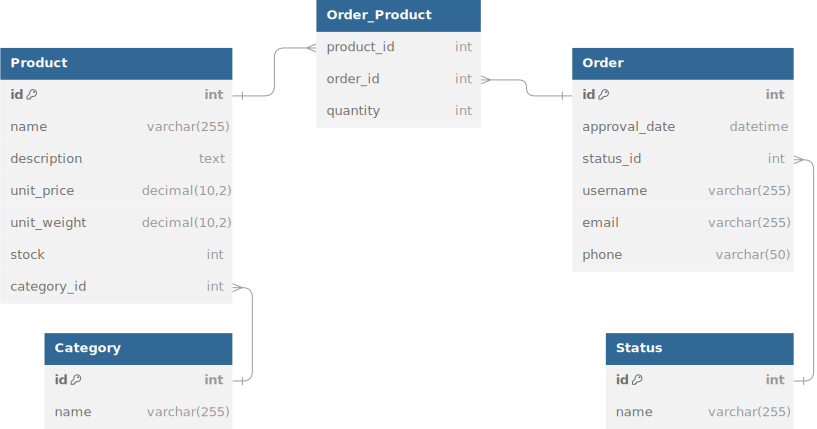

# AJI - Zadanie 3
Projekt na aplikacje w językach interpretowanych.
### RUN docker
```bash
docker compose up -d #docker compose down -v <- to stop and remove db volume
```
### RUN local
Node version: v20.18.0
1. Install dependancies:
    ```bash
    npm i -g @nestjs/cli
    npm install --save @nestjs/typeorm typeorm mysql2
    npm i --save class-validator class-transformer
    npm i --save @nestjs/config
    ```  
2. Deploy sql database
3. Run the app
    ```bash
    # watch mode
    $ npm run start:dev

    # production mode
    $ npm run start:prod
    ```
### ENV
```bash
PORT=3000

DATABASE_HOST=localhost
DATABASE_PORT=3306
DATABASE_USER=aji-user
DATABASE_PASSWORD=your_password
DATABASE_NAME=aji-db

TYPEORM_SYNC=true
```
### Database schema



Refer to the database schema code in dbdiagram.io
### API

_GET /status_

_GET /categories_

_GET /products_

_GET /products/:UUID_

_POST /products_
```json
{
    "name": "example2",
    "description": "This is a sample product description.",
    "price": 369.99,
    "weight": 15.99,
    "categoryName": "Books",
    "stock": 10
}
```
_PUT /products:UUID_
```json
{
    "name": "example2",
    "description": "This is a sample product description.",
    "price": 369.99,
    "weight": 15.99,
    "categoryName": "Books",
    "stock": 10
}
```
_GET /orders_

_GET /orders/:UUID_

_POST /orders_
```json
{
    "username": "john doe",
    "email": "john.doe@example.com",
    "phone": "1234567890",
    "products": [
        {
            "id": "UUID",
            "quantity": 1
        },
        {
            "id": "UUID",
            "quantity": 3
        }
    ]
}
```
_PUT /orders/:id <- only ORDER entity_
```json
{
  "username": "Updated User",
  "email": "updated.email@example.com",
  "phone": "1234567890",
  "statusName": "UNCONFIRMED"
}
```
_GET /orders/status/:statusNAME_
```UNCONFIRMED CONFIRMED COMPLETED CANCELLED```
PUT /orders/:orderUUID/products/:productUUID <- edit product stock in the eorder
```json
{
  "quantity": 80
}
```
_DELETE /orders/:orderUUID/products/:productUUID_ <- entirelly remove product from the order


